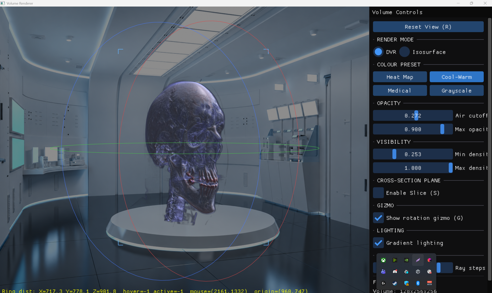
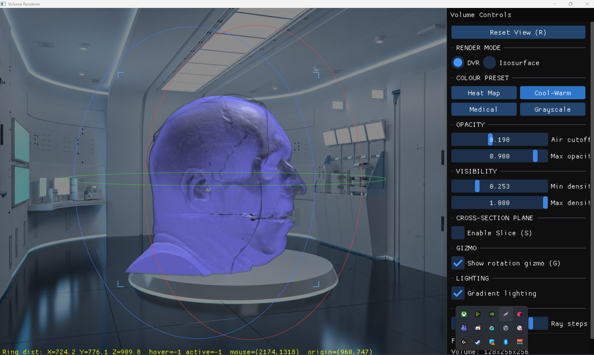
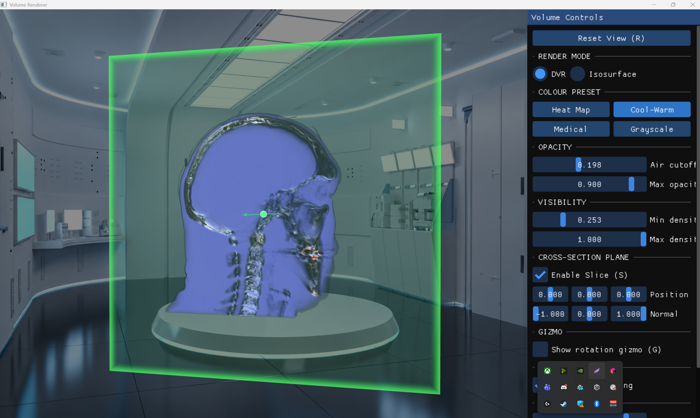
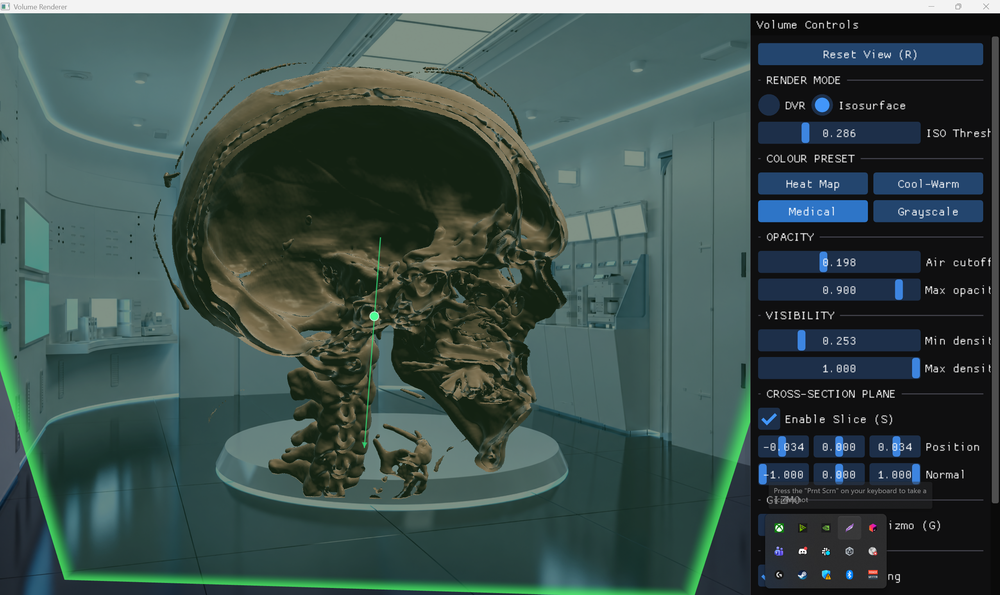

# OpenGL Volume Renderer

A standalone GPU-accelerated volume renderer built with C++17 and OpenGL 4.3. Implements real-time ray marching on the GPU with Direct Volume Rendering (DVR), Isosurface extraction, transfer functions, and interactive cross-section slicing.

Built from scratch as a desktop application

---

## Screenshots

### Direct Volume Rendering (DVR)

*DVR with Cool-Warm color preset and gradient lighting enabled. The turntable camera orbits the volume locked at the origin, with rotation gizmo rings and corner bracket overlays visible. Lab environment background with scene-matched lighting.*

### DVR Close-Up with Lighting

*Close-up view showing the DVR compositing with Phong shading, ambient color tinting matched to the background scene, and rim lighting on silhouette edges for realistic integration.*

### Cross-Section Plane

*Cross-section plane slicing through the volume. The translucent green quad with rim highlight shows the cut plane position. Plane gizmo allows interactive dragging along the normal. UI sliders provide precise control over position and orientation.*

### Isosurface with Cross-Section

*Isosurface rendering mode with cross-section enabled, revealing the internal bone structure. First-hit ray marching with gradient-based surface normals and Phong lighting produces a solid surface appearance.*

---

## Building

### Prerequisites
- CMake 3.20+
- Visual Studio 2022 (or any C++17 compiler)
- GPU with OpenGL 4.3 support

### Build Steps

```bash
# Generate Visual Studio solution
cmake -B build -G "Visual Studio 17 2022" -A x64

# Build
cmake --build build --config Release

# Run
build/Release/VolumeRenderer.exe
```

Dependencies (GLFW, GLM, ImGui) are downloaded automatically via CMake FetchContent.

```

### Keyboard Shortcuts

| Key | Action |
|-----|--------|
| `1` | DVR render mode |
| `2` | Isosurface render mode |
| `S` | Toggle cross-section plane |
| `G` | Toggle rotation gizmo |
| `R` | Reset view orientation |
| `Esc` | Quit |

### Mouse Controls

| Input | Action |
|-------|--------|
| Left drag | Orbit camera |
| Ctrl + Left drag | Rotate model |
| Scroll wheel | Zoom in/out |
| Drag gizmo ring | Rotate on axis |
| Drag plane handle | Move slice plane |

```

## License

MIT
